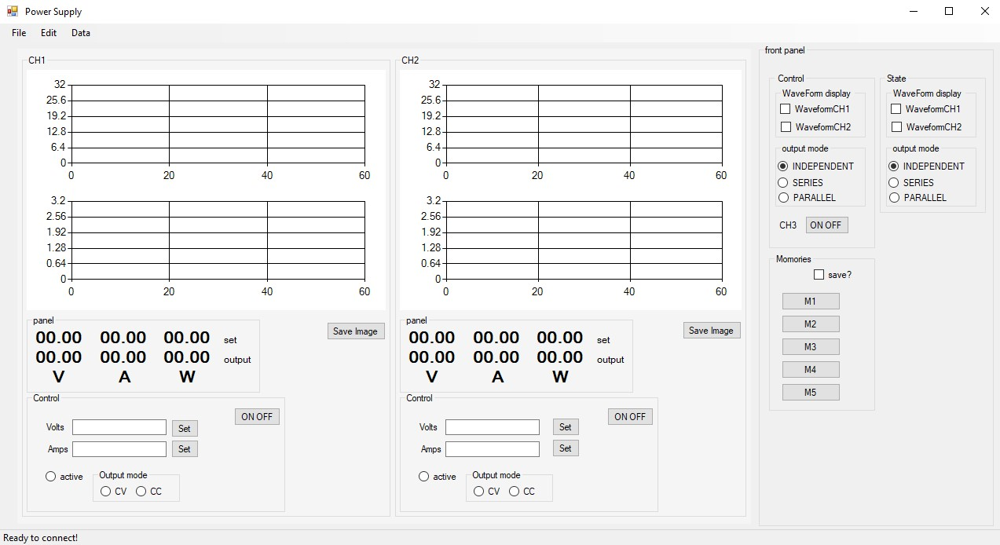
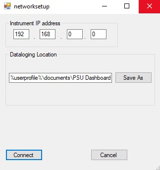
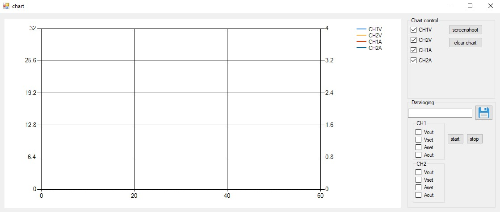

# Power-Supply-software
This software is to be used with the siglent spd series power supplies . it is not utilizing the visa lxi drivers only the SCPI commands and a TCP socket connection with the instrument at port 5025

Features :

1) Display every parameter of the supply on the computer screen
 > The software has clear readings for Voltage , current, power, what mode is 
 the instrument in and more. 

2) remote control of these parameters
> Allows to remotely change the Voltage , current setting for each channel , the active channel , the output state and other parameters of the instrument . 
Useful when you dent want to be close to the ...explosion area ;-)

3) create more readable charts of voltage , current and power
> Then the instrument has its outputs at parallel  or sires mode , the readings at the display remain separate , if the software is open when the instrument enters this state , it will display special charts and numeric displays , that have the reading summed appropriately . 

4) act as a data logger and save all info on a .csv file for future analysis

This software is inspired from the Siglent  `Easy Power` Software, but using only SCPI commands. Without any dependence on the very "clunky" NI Visa drivers. 

It can only use the Ethernet interface , USB was beyond my interest so I did not put any effort developing for it . 

Also , Timers are not implemented , I never really used them , or had a use for this feature.

# Table of Contents
1. [Main From](#Main-From)
2. [Setup](#Setup)
3. [Third Example](#third-example)

# Main From

This is the main form of the software, here you get an overview of the main parameters of the instrument , such as Voltage , Current , Wattage Both in a numerical form and in a chart. Active channel & channel state are also shown. 

From their respective Textboxes you can set the `Xset` value , (Voltage or Amps), or turn the Output on or off. 

Over at the left, you can see the output track state , if the instrument is in independent , Series or Parallel mode. you can see of the waveform display is on at the Siglent display. You can set them also ! (Memories are inoperative unfortunately , just a placeholder)

# Setup

Here you can set the instrument's IP Address , where the software will connect to , as well as the path to where the software will store the data it will collect. Screenshots and csv files. The default location is at `%userprofile%\Documents\PSU Dashboard` but if you wish a different path , you can set it here and it will remember it for next time

# Chart

